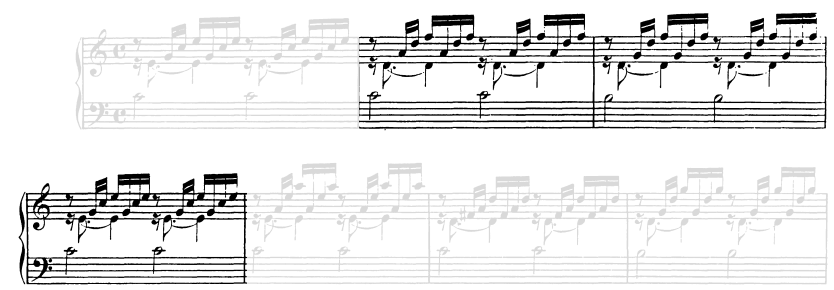

# Prolongations

# Resolutions

## Circle of Fifths 

### II-V-I

#### $ii_7 - V_7 - I$

- **Bach JS, BWV 846 m2:** With the ii's 7th in bass, held over from previous I. Bass does 1-1-7-1. Very prolongational. 

# Activations

