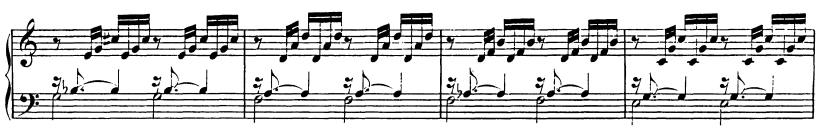
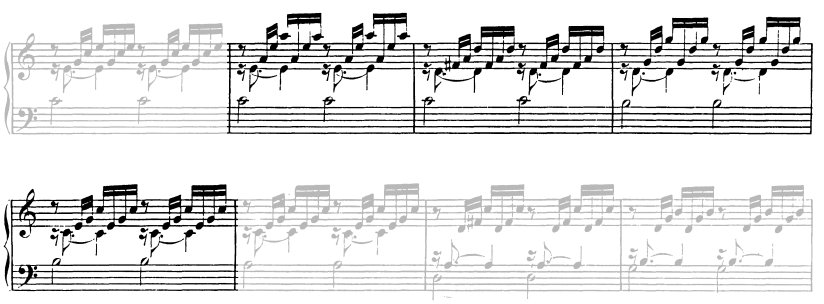

# Descending 2nd

## D2(D5D5)

### Tonicized Steps

#### \[vii^7\]-ii-\[vii^7\]-I

 - **Bach JS, BWV 846 m12:**

   

### Uneven Tonicizations

#### vi-\[V^7\]-V^7-I

 - **Bach JS, BWV 846 m5:** The final chord with the 7th in the bass is worthy of notice. This is smootly handled by the voice leading.

   
