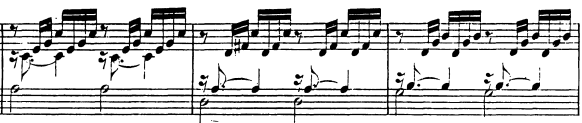
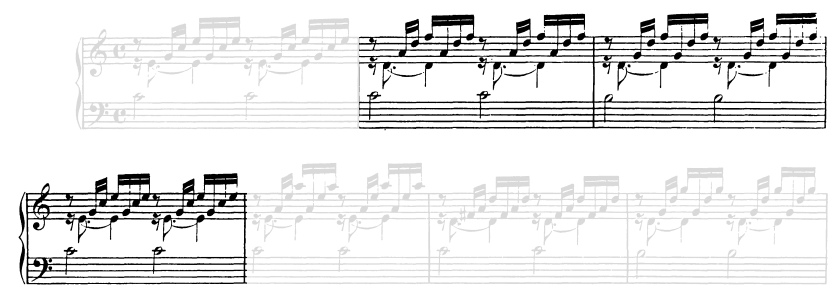

# Resolutions

## Circle of Fifths 

### II-V-I

#### $ii^7-V^7-I$

- **Bach JS, BWV 846 m9:** With 5-voice harmony, the doubling of 3rds seems the way to go, except for the leading tone (on V7).

  

# Activations

# Prolongations

## Of I

### I-II-V-I

- **Bach JS, BWV 846 m2:** The prolongation feeling is reinforced with the ii's 7th in bass, held over from previous I. Bass does 1-1-7-1, almost pedal like.

  
