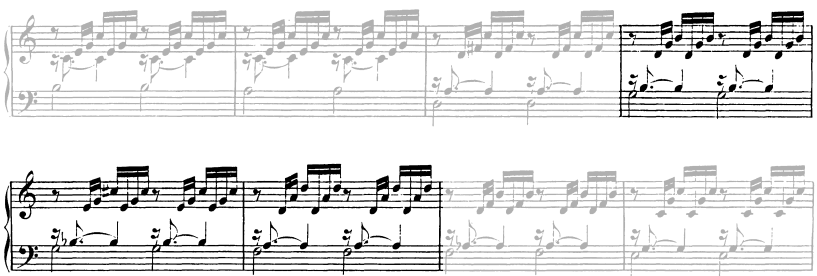

# Pivots

## Up a Fifth

### vi -> ii

- **Bach JS, BWV 846 m5:** Because of inversions, this pivot is accomplished with minimal bass movement.

   

### I -> IV

#### In Minor

- **Bach JS, BWV 846 m11:** The are many things at play in this passage. I still feel like this is made smoother by  this chord being coherent as IV of D melodic minor.

  

